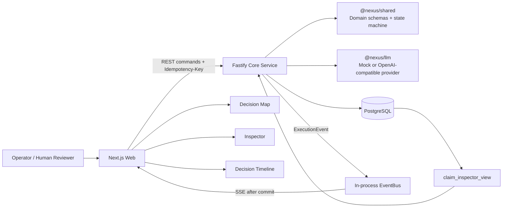
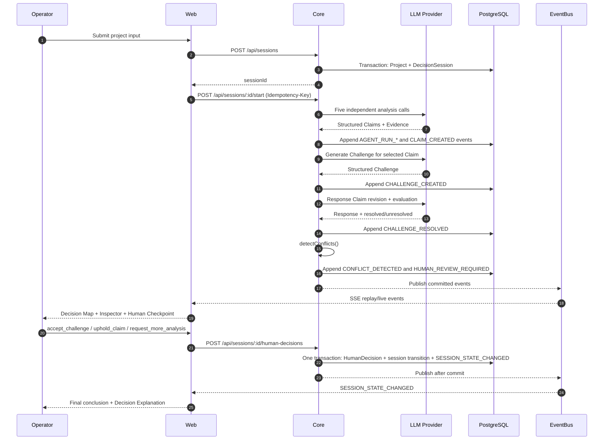
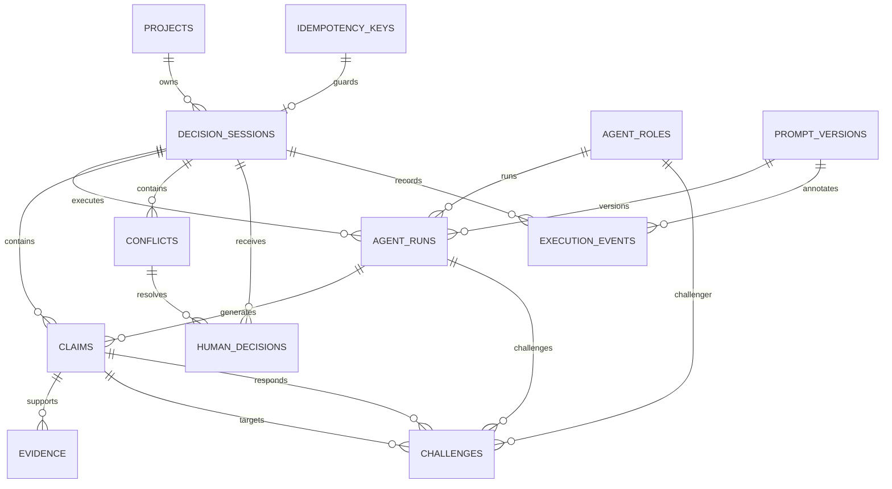

# Nexus Decision Arena 系统总览

## 1. 组件图

固定 Demo 是浏览器内的确定性 fixture 投影。真实 live session 通过 Core REST 命令、数据库事务和 SSE 事件更新同一套 Decision Map、Inspector、Timeline 和 Human Checkpoint 组件。

## 2. 分析、质询、冲突与人工裁决

## 3. ExecutionEvent 生命周期

ExecutionEvent 是不可变、按 session 单调递增的事实记录。写入先分配 sequence，再在同一数据库事务中插入事件；EventBus 只能在事务提交后发布。

| 类型 | 生产者 | 主要 payload / 状态作用 |
|---|---|---|
| `SESSION_STATE_CHANGED` | Session command 或 HumanDecision transaction | phase、operationalStatus、currentConclusion，人工裁决时附带 HumanDecision |
| `AGENT_RUN_STARTED` | Agent orchestration | role/run 进度；不改变领域结论 |
| `AGENT_RUN_COMPLETED` | Agent orchestration | AgentRun 完成与结构化输出引用 |
| `AGENT_RUN_FAILED` | `RunSessionService` | 单 Agent 失败隔离，不阻断其他角色 |
| `CLAIM_CREATED` | Claim persistence contract | Claim payload；客户端按 id upsert |
| `CHALLENGE_CREATED` | `CrossExaminationService` | Challenge payload 与 correlationId |
| `CHALLENGE_RESOLVED` | `CrossExaminationService` | 最终 Challenge status 与 responseClaimId |
| `CHALLENGE_FAILED` | `CrossExaminationService` | 单个 challenge 失败，不阻断其他 challenge |
| `CONFLICT_DETECTED` | `detectConflicts()` | Conflict payload；severity/impact 决定人工检查点 |
| `HUMAN_REVIEW_REQUIRED` | orchestration/checkpoint rule | phase=`HUMAN_REVIEW`、operationalStatus=`PAUSED` |
| `SESSION_COMPLETED` | report transition | 最终结论与报告就绪状态 |

SSE 以 `Last-Event-ID` 或 `after` 查询断点，先查询持久化事件，再接收实时事件。客户端通过 session 内连续 sequence 缓冲乱序事件；`sequence <= lastSequence` 的事件被忽略。

## 4. PostgreSQL 关系图

`Claim Inspector` 通过 `claim_inspector_view` 聚合 Claim、Evidence、Challenge 与 Conflict，再由 Repository 转为稳定的 camelCase DTO。Web 不直接依赖数据库表或 View 名称。

## 5. correlationId 传播规则

规则必须按下面的边界执行：

1. 每个业务工作单元开始时只生成一次 `correlationId`。AgentRun 生成一个 run-level id；`CrossExaminationService` 在每次“目标 Claim + challenger”尝试开始前调用 `newId()`，同一次尝试不得重新生成。
2. `Claim` 自身通过 `agentRunId` 关联生成来源，不携带独立 correlationId 字段。`CLAIM_CREATED` 事件的 `execution_events.correlation_id` 必须等于该 Claim 的 AgentRun correlationId；Inspector 由 `claim.agent_run_id -> agent_runs.correlation_id` 恢复该追踪值。
3. `Challenge.correlationId` 必须原样用于对应的 `CHALLENGE_CREATED`、`CHALLENGE_RESOLVED` 和 `CHALLENGE_FAILED` 事件。失败路径必须复用 challenge 尝试开始时捕获的 id，不能另生成 id。
4. `EventRepository.append()` 和 `DecisionSessionRepository.recordHumanDecision()` 将传入的 correlationId 原样写入 `execution_events`；事务提交后才由 `EventBus.publishAfterCommit()` 发布。
5. SSE 只按 session 和 sequence 排序，不重写 correlationId。浏览器 reducer 保持领域对象；Inspector 通过 Claim->AgentRun 和 Challenge 对象读取 correlationId。当前 Inspector 组件只展示 `decisionRationale`，不单独渲染 correlationId，但 DTO 的 `provenance.agentRun` 与 `challenges[].challenge` 保留该字段。
6. Human Decision 是一次新的业务工作单元，因此其 correlationId 使用 `HumanDecision.id`。该 id 同时用于 `SESSION_STATE_CHANGED` 事件与回放定位，确保人工裁决可从事件追到 Inspector 的 `decisionRationale.humanDecisionId`。

任何新增事件类型都必须保持上述“一个工作单元一个 correlationId、跨持久化与 SSE 原样传播”的不变量。